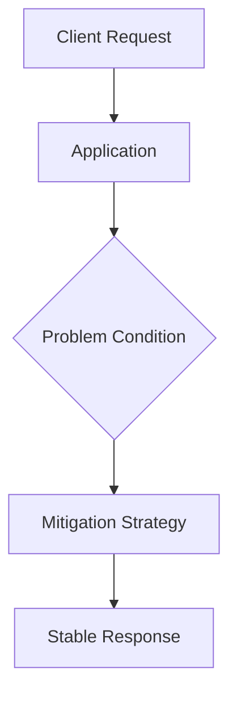

# <% tp.file.title %>

---
created: <% tp.date.now("YYYY-MM-DD HH:mm") %>
updated: <% tp.date.now("YYYY-MM-DD HH:mm") %>
tags:
  - backend
  - problem-pattern
status: active
related:
source:

---

> [!info] Problem Summary
> What is the problem in one or two lines?

## 1. Problem Description

## 2. When Does This Happen?

## 3. Why Is This Dangerous?

## 4. Symptoms in Production

## 5. Root Cause

## 6. Common Solutions

| Solution | When to use | Tradeoffs |
|---|---|---|
|  |  |  |

## 7. Recommended Real-World Approach

## 8. Design Decision Checklist

- [ ] Is latency more important than freshness?
- [ ] Can stale data be served?
- [ ] Is strict consistency required?
- [ ] Can the system tolerate retries?
- [ ] Is the problem local, distributed, or cross-service?

## 9. Example Architecture / Flow

## 10. Implementation Notes

## 11. Tradeoffs

## 12. Interview Explanation

## 13. Related Notes

- [[]]

## 14. Hands-on

- [ ] Build a small demo
- [ ] Simulate failure
- [ ] Apply solution
- [ ] Document observations
